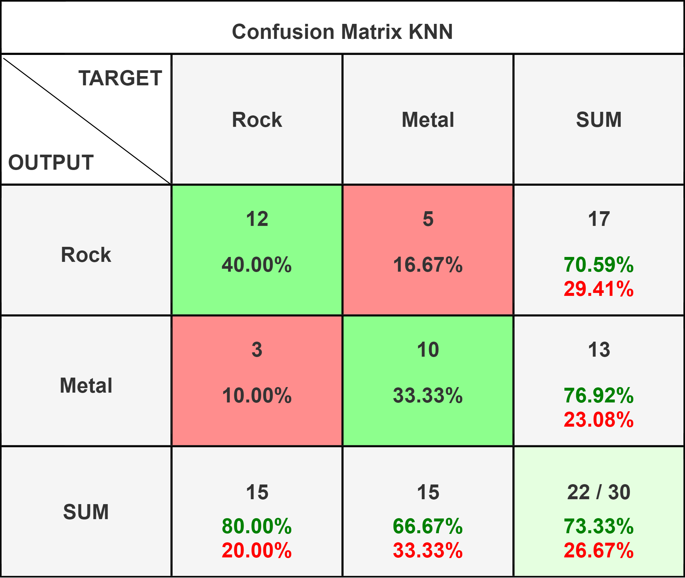
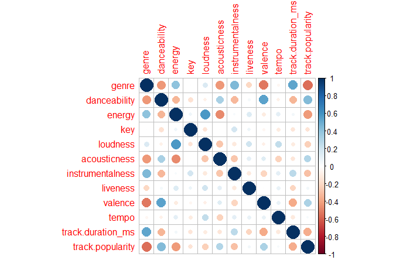
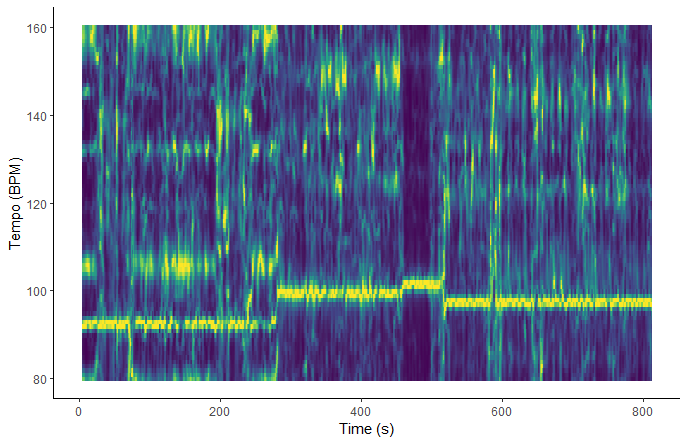
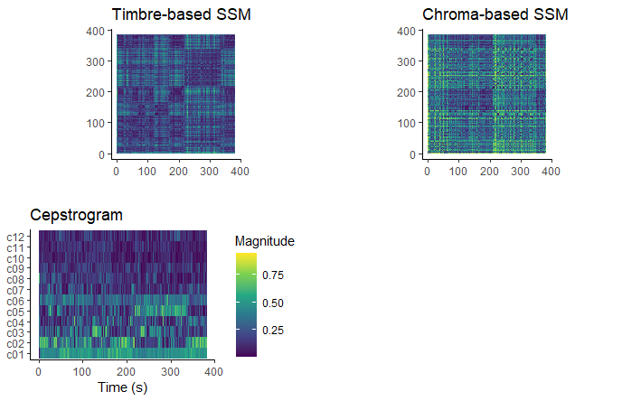
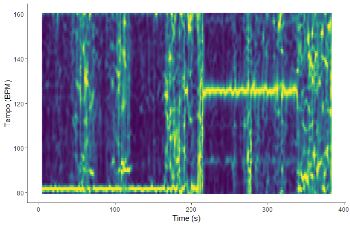

```{r setup, include=FALSE}
library(tidyverse)
library(spotifyr)
library(plotly)
library(compmus)
library(ggpubr)
metal <- get_playlist_audio_features("", "4jOlWW7XLRli6rjThfqlVl?si=781f9fafb8574da1") |> add_audio_analysis()
rock <- get_playlist_audio_features("", "43rPmb2v9YWmbotTymQLQE?si=fd6f70a6a61045a3") |> add_audio_analysis()
corpus <-
  bind_rows(
    rock |> mutate(genre = "Rock"),
    metal |> mutate(genre = "Metal")
  )
metal_stats <- metal |> 
  summarise(
    mean_valence = mean(metal$valence),
    mean_energy = mean(metal$energy),
    mean_dance = mean(metal$danceability),
    mean_tempo = mean(metal$tempo),
    mean_loudness = mean(metal$loudness),
    mean_pop = mean(metal$track.popularity)
    )
rock_stats <- rock |> 
  summarise(
    mean_valence = mean(rock$valence),
    mean_energy = mean(rock$energy),
    mean_dance = mean(rock$danceability),
    mean_tempo = mean(rock$tempo),
    mean_loudness = mean(rock$loudness),
    mean_pop = mean(rock$track.popularity)
    )

corp_stats <-
  bind_rows(
    rock_stats |> mutate(genre = "Rock"),
    metal_stats |> mutate(genre = "Metal")
)

circshift <- function(v, n) {
  if (n == 0) v else c(tail(v, n), head(v, -n))
}

#      C     C#    D     Eb    E     F     F#    G     Ab    A     Bb    B
major_chord <-
  c(   1,    0,    0,    0,    1,    0,    0,    1,    0,    0,    0,    0)
minor_chord <-
  c(   1,    0,    0,    1,    0,    0,    0,    1,    0,    0,    0,    0)
seventh_chord <-
  c(   1,    0,    0,    0,    1,    0,    0,    1,    0,    0,    1,    0)

major_key <-
  c(6.35, 2.23, 3.48, 2.33, 4.38, 4.09, 2.52, 5.19, 2.39, 3.66, 2.29, 2.88)
minor_key <-
  c(6.33, 2.68, 3.52, 5.38, 2.60, 3.53, 2.54, 4.75, 3.98, 2.69, 3.34, 3.17)

chord_templates <-
  tribble(
    ~name, ~template,
    "Gb:7", circshift(seventh_chord, 6),
    "Gb:maj", circshift(major_chord, 6),
    "Bb:min", circshift(minor_chord, 10),
    "Db:maj", circshift(major_chord, 1),
    "F:min", circshift(minor_chord, 5),
    "Ab:7", circshift(seventh_chord, 8),
    "Ab:maj", circshift(major_chord, 8),
    "C:min", circshift(minor_chord, 0),
    "Eb:7", circshift(seventh_chord, 3),
    "Eb:maj", circshift(major_chord, 3),
    "G:min", circshift(minor_chord, 7),
    "Bb:7", circshift(seventh_chord, 10),
    "Bb:maj", circshift(major_chord, 10),
    "D:min", circshift(minor_chord, 2),
    "F:7", circshift(seventh_chord, 5),
    "F:maj", circshift(major_chord, 5),
    "A:min", circshift(minor_chord, 9),
    "C:7", circshift(seventh_chord, 0),
    "C:maj", circshift(major_chord, 0),
    "E:min", circshift(minor_chord, 4),
    "G:7", circshift(seventh_chord, 7),
    "G:maj", circshift(major_chord, 7),
    "B:min", circshift(minor_chord, 11),
    "D:7", circshift(seventh_chord, 2),
    "D:maj", circshift(major_chord, 2),
    "F#:min", circshift(minor_chord, 6),
    "A:7", circshift(seventh_chord, 9),
    "A:maj", circshift(major_chord, 9),
    "C#:min", circshift(minor_chord, 1),
    "E:7", circshift(seventh_chord, 4),
    "E:maj", circshift(major_chord, 4),
    "G#:min", circshift(minor_chord, 8),
    "B:7", circshift(seventh_chord, 11),
    "B:maj", circshift(major_chord, 11),
    "D#:min", circshift(minor_chord, 3)
  )

key_templates <-
  tribble(
    ~name, ~template,
    "Gb:maj", circshift(major_key, 6),
    "Bb:min", circshift(minor_key, 10),
    "Db:maj", circshift(major_key, 1),
    "F:min", circshift(minor_key, 5),
    "Ab:maj", circshift(major_key, 8),
    "C:min", circshift(minor_key, 0),
    "Eb:maj", circshift(major_key, 3),
    "G:min", circshift(minor_key, 7),
    "Bb:maj", circshift(major_key, 10),
    "D:min", circshift(minor_key, 2),
    "F:maj", circshift(major_key, 5),
    "A:min", circshift(minor_key, 9),
    "C:maj", circshift(major_key, 0),
    "E:min", circshift(minor_key, 4),
    "G:maj", circshift(major_key, 7),
    "B:min", circshift(minor_key, 11),
    "D:maj", circshift(major_key, 2),
    "F#:min", circshift(minor_key, 6),
    "A:maj", circshift(major_key, 9),
    "C#:min", circshift(minor_key, 1),
    "E:maj", circshift(major_key, 4),
    "G#:min", circshift(minor_key, 8),
    "B:maj", circshift(major_key, 11),
    "D#:min", circshift(minor_key, 3)
  )
```
# New Stuff {.storyboard}

### KNN Classification of Nebulous Subgenres


***

I used my (very limited) corpus to train a KNN classifier. I used basically every numerical feature Spotify calculated, as I have not been able to find any that clearly distinguish the songs in my Metal playlist from those in my Rock playlist. I set k=10, as there are 100 songs in my playlist, and 10 is the square root of 100. I have tried other values for k but none outperform k=10.\
As visible in the confusion matrix this algorithm performs fairly well, but it is most definitely biased as the dataset is quite small, to (hopefully) improve it I performed some feature analysis to see what features correlate the most with genre.

### Feature Analysis for Classification 


***
The popularity of a track, the valence and the duration of the track seem to be the features that correlate with genre the most, followed by danceability, energy, acousticness and instrumentalness. Making a KNN with only the top 3 features and a KNN with the top 7 seems to be a viable strategy.

### Final KNN
.png)

***
After some teaking this KNN algortithm had the best results, this is the one I'll be using in the following experiment. I'll be looking at three genres which are not featured in my main playlist, and see how "Metal" they are according to this classifier.


### Results
```{r knn}
knn_res_plot <- readRDS(file = "data/knn_res_plot.RDS")
knn_res_plot
```
*** 
#### Quick Introduction to the Genres
TODO

#### Expectations

#### Conclusion


# Corpus {.storyboard}
### Introducing My Taste in Music

```{=html}
<iframe style="border-radius:20px"
src="https://open.spotify.com/embed/playlist/09ybINQumucmE0BMdYakx2?" width="100%" height="152" frameBorder="0" allowtransparency="true" allow="encrypted-media" data-external="1"></iframe>
```

For this project I have chosen 10 bands, 5 of which are not considered Rock but not Metal bands and 5 of which are considered Metal bands. Metal is a subgenre of Rock that has a multitude of subgenres of itself. Metal is defined as: ["a type of Rock music with a very strong beat played very loud on electric guitars"](https://www.oxfordlearnersdictionaries.com/definition/american_english/heavy-metal#). Which is a bit of a vague definition in my opinion. When does a song have a strong enough beat or when is it played loud enough to be considered metal? My goal is to see how easily distinguishable these genres actually are if we looked at different features of songs in both playlists.\

#### Band selection
The Rock bands I picked are: Queens of the Stone Age, Radiohead, Queen, Led Zeppelin and Arctic Monkeys. \
The Metal bands I picked are: Metallica, Death, Gojira, Opeth and TOOL.\
For both groups I tried to pick bands that sound as distinct as possible from eachother, however this list is definitely too limited to provide a complete overview of both genres. The non-Metal bands I chose are varied enough but still don't provide an overview of the genre in its entirety and 3 of the 5 metal bands I chose fall into different categories of the Death Metal subgenre.\

#### Song selection
For the rock songs I mainly focused on somewhat high tempo guitar based music, to make the distinction between Metal and Rock as hard as possible. Some Queen and Radiohead songs are obvious exceptions to this, however I feel these are still interesting to analyse as they often have shifting dynamics, or they can provide a baseline to define a non-Metal Rock song. Queens of the Stone Age is the non-Metal band that comes closest to being a Metal band, but I decided not to include their actual Metal songs. Led Zeppelin is often credited for at least partially inspiring the Metal genre.\
For the Metal playlist I picked songs that are unmistakably Metal. Metallica is an obvious inclusion, however I only added songs from their early Thrash Metal days. Death and Gojira fit the bill as well.\

#### Outliers
Queens of the Stone Age - 'My God is the Sun'; Heavy non-Metal song.\
Radiohead - 'Paranoid Android'; Alternates between soft Rock parts and chaotic loud solos.\
Led Zeppelin - 'Immigrant Song'; Considered "Proto-Metal", influential on the genre.\
Opeth - 'The Leper Affinity'; Good example of Opeth's dynamics.\
TOOL - 'Bottom' and 'Ticks & Leeches'; Both songs have very quiet build-up parts in the middle.

### Is Metal that Much Angrier?
```{r valen}
plot_1 <- corpus |>                    # Start with corpus.
  mutate(
    mode = ifelse(mode == 0, "Minor", "Major"),
    name = corpus$track.name
  ) |>
  ggplot(                     # Set up the plot.
    aes(
      name = name,
      x = valence,
      y = energy,
      size = loudness,
      colour = mode
    )
  ) +
  geom_point() +              # Scatter plot.
  geom_rug(linewidth = 0.1) + # Add 'fringes' to show data distribution.

    geom_vline(aes(xintercept = mean_valence), corp_stats, color = "purple", linewidth = 0.2, show.legend = TRUE) +
  geom_hline(aes(yintercept = mean_energy), corp_stats, color = "purple", linewidth = 0.2, show.legend = TRUE) +

  facet_wrap(~ genre) +    # Separate charts per playlist.
  scale_x_continuous(         # Fine-tune the x axis.
    limits = c(0, 1),
    breaks = c(0, 0.50, 1),   # Use grid-lines for quadrants only.
    minor_breaks = NULL       # Remove 'minor' grid-lines.
  ) +
  scale_y_continuous(         # Fine-tune the y axis in the same way.
    limits = c(0, 1),
    breaks = c(0, 0.50, 1),
    minor_breaks = NULL
  ) +
  scale_colour_brewer(        # Use the Color Brewer to choose a palette.
    type = "qual",            # Qualitative set.
    palette = "Set1"        # Name of the palette is 'Paired'.
  ) +
  scale_size_continuous(      # Fine-tune the sizes of each point.
    trans = "exp",            # Use an exp transformation to emphasise loud.
    guide = "none"            # Remove the legend for size.
  ) +
  theme_minimal() +             # Use a simpler theme.
  labs(                       # Make the titles nice.
    x = "Valence",
    y = "Energy",
    colour = "Mode"
  )
ggplotly(p = plot_1)
```
***

By looking at this plot it's obvious that the songs in the Metal part of the playlist are a lot more clustered toward high energy and low valence. The Rock songs seem to be a lot more scattered, which could be explained by the variety of Rock subgenres in that part of the playlist. The purple lines represent the means of both variables in both playlists and show a that Metal tends to have a lower valence and a higher energy. So yes, Metal is angrier (on average at least).\
I will be exploring this topic under [this](#emotions) tab.


### Tempo and Popularity
```{r rhythm}
plot_2 <- corpus |>                    # Start with corpus.
  mutate(
    name = corpus$track.name,
    popularity = corpus$track.popularity,
    duration = track.duration_ms,
    time_signature = ifelse(time_signature == 4, "Even", "Odd")
  ) |>
  ggplot(                     # Set up the plot.
    aes(
      name = name,
      x = popularity,
      y = tempo,
      size = duration/60,
      colour = time_signature
    )
  ) +
  geom_point() +              # Scatter plot.
  geom_rug(linewidth = 0.1) + # Add 'fringes' to show data distribution.
  geom_vline(aes(xintercept = mean_pop), corp_stats, color = "purple", linewidth = 0.2, show.legend = TRUE) +
  geom_hline(aes(yintercept = mean_tempo), corp_stats, color = "purple", linewidth = 0.2, show.legend = TRUE) +
  facet_wrap(~ genre) +    # Separate charts per playlist.
  scale_x_continuous( # Fine-tune the x axis.
    limits = c(0, 100),
    breaks = c(0, 50, 100),   # Use grid-lines for quadrants only.
    minor_breaks = NULL       # Remove 'minor' grid-lines.
  ) +
  scale_y_continuous(         # Fine-tune the y axis in the same way.
    limits = c(60, 200),
    breaks = c(60, 130, 200),
    minor_breaks = NULL
  ) +
  scale_colour_brewer(        # Use the Color Brewer to choose a palette.
    type = "qual",            # Qualitative set.
    palette = "Set1"        # Name of the palette is 'Paired'.
  ) +
  theme_minimal() +             # Use a simpler theme.
  labs(                       # Make the titles nice.
    x = "Popularity",
    y = "Tempo",
    colour = "Time signature",
    size = ''
  )
ggplotly(p = plot_2)
```
***

Contrary to the definition of the genre, the mean tempo of the Metal playlist is actually slightly lower than the mean tempo of the Rock playlist. This could be because Metal tracks feature more tempo changes and have are often structured differently than (popular) Rock tracks. This is a topic I will explore more in the [structures](#structures) tab. However as it only differs 3 bpm, it's not a significant difference.\
As I expected, the songs on my metal playlist are slightly less popular than the songs in my Rock playlist. This could be due to track and mostly band selection, as there's no clear indication that tempo has anything to do with it. Interestingly though, the least popular Metal track is still more popular than the least popular Rock tracks.\

### SD and mean tempo
```{r sd_stuff}
plt_3 <- corpus |>
  mutate(
    popularity = track.popularity,
    name = track.name,
    sections =
      map(
        sections,                                    # sections or segments
        summarise_at,
        vars(tempo, duration),             # features of interest
        list(section_mean = mean, section_sd = sd)   # aggregation functions
      )
  ) |>
  unnest(sections) |>
  ggplot(
    aes(
      name = name,
      x = tempo,
      y = tempo_section_sd,
      colour = genre
    )
  ) +
  geom_point(aes(size = duration / 60)) +
  geom_rug() +
  scale_colour_brewer(        # Use the Color Brewer to choose a palette.
    type = "qual",            # Qualitative set.
    palette = "Set1"        # Name of the palette is 'Paired'.
  ) +
  theme_minimal() +
  ylim(0, 5) +
  labs(
    x = "Mean Tempo (bpm)",
    y = "SD Tempo",
    colour = "Genre",
    size = "Duration (min)"
  )
ggplotly(p=plt_3)
```
*** 
Metal tracks tend to have more varying tempos than rock tracks. (WIP)

# Emotions {.storyboard}

### Introducting Keys 
```{r hist}

hist <-  
  ggplot(corpus, aes(x=key_mode)) + 
  geom_histogram(stat="count", binwidth = 1, color = 'black', fill = 'red') +
  facet_wrap(~ genre) +
  theme_minimal()+
  theme(axis.text.x = element_text(angle = 90, vjust = 0.5, hjust=1),
        axis.title.x = element_blank(),
        axis.title.y = element_blank()
        )

ggplotly(p=hist)
```
***
The key a song is written in plays a major role in the emotional perception of a track. Minor keys are often deemed sadder or less energetic, while major keys are often described as happier or more energetic. As seen on [this tab](###tempo-and-popularity), these descriptions aren't always accurate.\
For every existent key, there is at least one song in the Rock playlist that uses it, this is not the case for the Metal playlist however. The popularity of Em among Metal tracks is unsurprising, as the key represents [grief, mournfulness and restlessness of spirit](https://interlude.hk/feel-key-e-minor/#:~:text=Pauer's%20key%20characteristics%20for%20E,of%20pieces%20in%20E%20minor.). For the Rock playlist there is not really a key that stands out as much.

### Back to Keys (1/3)
```{r stwy}
stairway <-
  get_tidy_audio_analysis("5CQ30WqJwcep0pYcV4AMNc?si=682bdf162f4c4dcd") |>
  compmus_align(sections, segments) |>
  select(sections) |>
  unnest(sections) |>
  mutate(
    pitches =
      map(segments,
          compmus_summarise, pitches,
          method = "mean", norm = "manhattan"
      )
  )

s_keygram <- stairway |> 
  compmus_match_pitch_template(
    key_templates,         # Change to chord_templates if descired
    method = "euclidean",  # Try different distance metrics
    norm = "manhattan"     # Try different norms
  ) |>
  ggplot(
    aes(x = start + duration / 2, width = duration, y = name, fill = d)
  ) +
  geom_tile() +
  scale_fill_viridis_c(guide = "none") +
  theme_minimal() +
  labs(x = "Time (s)", y = "") +
  ggtitle("Keygram")
ggplotly(p=s_keygram)
```

***
```{=html}
<iframe style="border-radius:20px"
src="https://open.spotify.com/embed/track/5CQ30WqJwcep0pYcV4AMNc?si=682bdf162f4c4dcd" width="100%" height="152" frameBorder="0" allowtransparency="true" allow="encrypted-media" data-external="1"></iframe>
```

As this song is in the key of Am, the keygram seems to be rather accurate. As this song is quite long and has an interesting structure I'd expected the keygran to do worse.

### Back to Keys (2/3)

```{r mop}
master <-
  get_tidy_audio_analysis("2MuWTIM3b0YEAskbeeFE1i?si=f1b442b834af43b4") |>
  compmus_align(sections, segments) |>
  select(sections) |>
  unnest(sections) |>
  mutate(
    pitches =
      map(segments,
          compmus_summarise, pitches,
          method = "mean", norm = "manhattan"
      )
  )

m_keygram <- master |> 
  compmus_match_pitch_template(
    key_templates,         # Change to chord_templates if descired
    method = "euclidean",  # Try different distance metrics
    norm = "manhattan"     # Try different norms
  ) |>
  ggplot(
    aes(x = start + duration / 2, width = duration, y = name, fill = d)
  ) +
  geom_tile() +
  scale_fill_viridis_c(guide = "none") +
  theme_minimal() +
  labs(x = "Time (s)", y = "") +
  ggtitle("Keygram")
ggplotly(p=m_keygram)
```

***
```{=html}
<iframe style="border-radius:20px"
src="https://open.spotify.com/embed/track/2MuWTIM3b0YEAskbeeFE1i?si=f1b442b834af43b4" width="100%" height="152" frameBorder="0" allowtransparency="true" allow="encrypted-media" data-external="1"></iframe>
```

This song is in the key of Em, which is also pretty obvious from the keygram. Before and a bit after the 300s mark the keygram seems to do a little worse, but overall it gets it right.

### Back to Keys (3/3)
```{r lot}
lotus <-
  get_tidy_audio_analysis("2ka0Oum3mNMGGXL9gBqdkq?si=d0cc5f6e3df641ba") |>
  compmus_align(sections, segments) |>
  select(sections) |>
  unnest(sections) |>
  mutate(
    pitches =
      map(segments,
          compmus_summarise, pitches,
          method = "mean", norm = "manhattan"
      )
  )

l_keygram <- lotus |> 
  compmus_match_pitch_template(
    key_templates,         # Change to chord_templates if descired
    method = "euclidean",  # Try different distance metrics
    norm = "manhattan"     # Try different norms
  ) |>
  ggplot(
    aes(x = start + duration / 2, width = duration, y = name, fill = d)
  ) +
  geom_tile() +
  scale_fill_viridis_c(guide = "none") +
  theme_minimal() +
  labs(x = "Time (s)", y = "") +
  ggtitle("Keygram")
ggplotly(p=l_keygram)
```

*** 
```{=html}
<iframe style="border-radius:20px"
src="https://open.spotify.com/embed/track/2ka0Oum3mNMGGXL9gBqdkq?si=d0cc5f6e3df641ba" width="100%" height="152" frameBorder="0" allowtransparency="true" allow="encrypted-media" data-external="1"></iframe>
```

Unlike the previous two examples, it doesn't work for this song at all. It's supposed to be in Em, however from the keygram that is impossible to tell.

### Songs with Low Valence (1/3)
```{r tosir}
to_sirius <-
  get_tidy_audio_analysis("1BcuFfskHNf1WvqpyCs4wT?si=188253483ba54d55") |>
  select(segments) |>
  unnest(segments) |>
  select(start, duration, pitches)
plot_3 <- to_sirius |>
  mutate(pitches = map(pitches, compmus_normalise, "euclidean")) |>
  compmus_gather_chroma() |> 
  ggplot(
    aes(
      x = start + duration / 2,
      width = duration,
      y = pitch_class,
      fill = value
    )
  ) +
  geom_tile() +
  labs(x = "Time (s)", y = NULL, fill = "Magnitude") +
  theme_minimal() +
  scale_fill_viridis_c()
ggplotly(p=plot_3)
```

***
```{=html}
<iframe style="border-radius:20px"
src="https://open.spotify.com/embed/track/1BcuFfskHNf1WvqpyCs4wT?si=188253483ba54d55" width="100%" height="152" frameBorder="0" allowtransparency="true" allow="encrypted-media" data-external="1"></iframe>
```
This song has the lowest valence of not only the Metal part of the corpus, but of the corpus in its entirety. It also happens to have the highest energy of the entire corpus. The chromagram makes that pretty clear, by being almost entirely incomprehensible. The only pitch class which seems to be prevalent is the F. The parts at around 140 seconds and at 200 seconds stand out, as there are no real pitch classes that seem to be prevalent at all. In these parts the singing and the instrumental change a bit from the rest of the song, the singing making way for a low grunt and the palm muted guitars allow the drums to rise to the center of attention, muddling the chromagram.  

### Songs with Low Valence (2/3)
```{r creep}
creep <-
  get_tidy_audio_analysis("70LcF31zb1H0PyJoS1Sx1r?si=b7cfbb858fd645ac") |>
  select(segments) |>
  unnest(segments) |>
  select(start, duration, pitches)
plot_4 <- creep |>
  mutate(pitches = map(pitches, compmus_normalise, "euclidean")) |>
  compmus_gather_chroma() |> 
  ggplot(
    aes(
      x = start + duration / 2,
      width = duration,
      y = pitch_class,
      fill = value
    )
  ) +
  geom_tile() +
  labs(x = "Time (s)", y = NULL, fill = "Magnitude") +
  theme_minimal() +
  scale_fill_viridis_c()
ggplotly(p = plot_4)
```

***

```{=html}
<iframe style="border-radius:20px"
src="https://open.spotify.com/embed/track/70LcF31zb1H0PyJoS1Sx1r?si=b7cfbb858fd645ac" width="100%" height="152" frameBorder="0" allowtransparency="true" allow="encrypted-media" data-external="1"></iframe>
```
"Creep" by Radiohead scores lowest on valence in the Rock half of the corpus and the song scores a lot lower on energy than "To Sirius" on the previous page. Here the chord progression is a lot easier to read, as the G, B and C are the pitch classes with the highest magnitude.

### Songs with Low Valence (3/3)

```{r creep2}
creep <-
  get_tidy_audio_analysis("70LcF31zb1H0PyJoS1Sx1r?si=b753ddf24d3e430f") |>
  compmus_align(bars, segments) |>
  select(bars) |>
  unnest(bars) |>
  mutate(
    pitches =
      map(segments,
          compmus_summarise, pitches,
          method = "mean", norm = "manhattan"
      )
  )

c_chordogram <- creep |> 
  compmus_match_pitch_template(
    chord_templates,         # Change to chord_templates if descired
    method = "euclidean",  # Try different distance metrics
    norm = "manhattan"     # Try different norms
  ) |>
  ggplot(
    aes(x = start + duration / 2, width = duration, y = name, fill = d)
  ) +
  geom_tile() +
  scale_fill_viridis_c(guide = "none") +
  theme_minimal() +
  labs(x = "Time (s)", y = "") +
  ggtitle("Chordogram")
ggplotly(p=c_chordogram)
```
***
(I'm not sure if I'm keeping this as a separate page or if I'm swapping this with the chromagram for Creep, as this is basically the same information.)\
As "Creep" has an interesting but simple chord progression, it's chordogram is clear. The four chords constantly looping are G, B, C and Cm and those are the only four chords in the song.

# Structures {.storyboard}
### Histogram of Tempi
```{r tmphist}
hist <-  
  ggplot(corpus, aes(x=tempo)) + 
  geom_histogram(binwidth = 5, color = 'black', fill = 'blue') +
  facet_wrap(~ genre) +
  theme_minimal()+
  theme(axis.text.x = element_text(angle = 90, vjust = 0.5, hjust=1),
        axis.title.x = element_blank(),
        axis.title.y = element_blank()
  )

ggplotly(p=hist)
```
***
In this histogram it's quite clear that the songs in the Metal playlist overall tend to be a bit slower than the songs in the Rock playlist. This could might be because the songs in the Metal playlist tend to have more shifting tempos, as seen in one of my earlier visualizations on the Corpus tab.

### Songs with Weird Structures (1/2)


***

```{=html}
<iframe style="border-radius:20px"
src="https://open.spotify.com/embed/track/4siXNiLG9VJR6Z2kP6fFjv?" width="100%" height="152" frameBorder="0" allowtransparency="true" allow="encrypted-media" data-external="1"></iframe>
```

The song "Deliverance" by Opeth is part of the Progressive Death Metal subgenre, which explains its peculiar structure. As visible in the cepstrogram the timbre changes at around a minute and 10 seconds in, when the vocalist starts singing instead of his usual low growling and more importantly the guitar tone changes from heavily distorted to clean. At roughly 5 minutes into the song, the clean singing starts again, however this part does feature a distorted guitar, so this is not visible in the cepstrogram. The self-similarity matrices highlight the same clean part as an outlier, and both show a highlight at around 10 minutes in at the introduction of the outro riff.

### Tempogram Deliverance



***
In the tempogram of the song the highlights seen in its SSM aren't visible, so the tempo remains the same but it's just the instrumental that changes. This is quite interesting as I find the clean passage near the start of the song to be slower than the intro. The part where all music suddenly drops out at the beginning of this clean part is visible in the tempogram however. There are some highlights at around 160 bpm throughout the song, but those are probably just a product of tempo octaves.

### Songs with Weird Structures (2/2)



***

```{=html}
<iframe style="border-radius:20px"
src="https://open.spotify.com/embed/track/6LgJvl0Xdtc73RJ1mmpotq?si=cb296db6ab774280" width="100%" height="152" frameBorder="0" allowtransparency="true" allow="encrypted-media" data-external="1"></iframe>
```

Another song in my corpus with an interesting structure is "Paranoid Android" by Radiohead. However where "Deliverance" has a clear standout moment, this song consists of three audibly different parts: the intro, the aggressive part and the "rain down" part (from around 3:35 to around 6:10). These different parts aren't clearly visible in the chroma based SSM unfortunately, as it shows so many significant changes it becomes a bit messy. These changes are visible in the cepstrogram and the timbre based SSM, however. This may have something to do with the fact the the song stays in the same key, but the instrumentation varies from an acoustic guitar in the intro and the "rain down" part to distorted guitars in the aggressive parts.

### Tempogram Paranoid Android


***
The changes from the softer to the aggressive parts are quite clear from the tempogram, even moreso than from the SSMs. However the tempogram does not seem to be sure as to what the tempo of the ending is. I had expected it to fall back down to around 80 bpm, so the same as the start of the song. Again there's some visual noise, however it doesn't appear to be at the tempo octaves.
