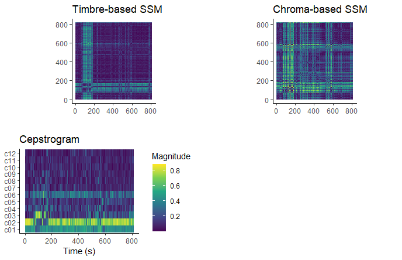

```{r setup, include=FALSE}
library(tidyverse)
library(spotifyr)
library(plotly)
library(compmus)
library(ggpubr)
metal <- get_playlist_audio_features("", "4jOlWW7XLRli6rjThfqlVl?si=781f9fafb8574da1")
rock <- get_playlist_audio_features("", "43rPmb2v9YWmbotTymQLQE?si=fd6f70a6a61045a3")
corpus <-
  bind_rows(
    rock |> mutate(genre = "Rock"),
    metal |> mutate(genre = "Metal")
  )

```

### Deliverance



***

```{=html}
<iframe style="border-radius:20px"
src="https://open.spotify.com/embed/track/4siXNiLG9VJR6Z2kP6fFjv?" width="100%" height="152" frameBorder="0" allowtransparency="true" allow="encrypted-media" data-external="1"></iframe>
```

The song "Deliverance" by Opeth is part of the progressive death metal subgenre, which explains its peculiar structure. As visible in the cepstrogram the timbre changes at around a minute and 10 seconds in, when the vocalist starts singing instead of his usual beastly growling and more importantly the guitar tone changes from heavily distorted to clean. At roughly 5 minutes into the song, the clean singing starts again, however this part does feature a distorted guitar, so this is not visible in the cepstrogram. The self-similarity matrices highlight the same clean part as an outlier, and both show a highlight at around 10 minutes in at the introduction of the outro riff.

### Paranoid Android


***

```{=html}
<iframe style="border-radius:20px"
src="https://open.spotify.com/embed/track/6LgJvl0Xdtc73RJ1mmpotq?si=cb296db6ab774280" width="100%" height="152" frameBorder="0" allowtransparency="true" allow="encrypted-media" data-external="1"></iframe>
```

Another song in my corpus with an interesting structure is "Paranoid Android" by Radiohead. However where "Deliverance" has a clear standout moment, this song consists of three audibly different parts: the intro, the aggressive part and the "rain down" part (from around 3:35 to around 6:10). These different parts aren't clearly visible in the chroma based SSM unfortunately, as it shows so many significant changes it becomes a bit messy. These changes are visible in the cepstrogram and the timbre based SSM, however. This may have something to do with the fact the the song stays in the same key, but the instrumentation varies from an acoustic guitar in the intro and the "rain down" part to distorted guitars in the aggressive parts.

### Introducing My Taste in Music
```{=html}
<iframe style="border-radius:20px"
src="https://open.spotify.com/embed/playlist/09ybINQumucmE0BMdYakx2?" width="100%" height="152" frameBorder="0" allowtransparency="true" allow="encrypted-media" data-external="1"></iframe>
```

I have chosen 10 bands, 5 of which are not considered metal bands and 5 of which are considered metal bands. My goal is to see how easily distinguishable these genres actually are if we looked at the Spotify statistics.\

#### Band selection
The non-metal bands I picked are: Queens of the Stone Age, Radiohead, Queen, Led Zeppelin and Arctic Monkeys. \
The metal bands I picked are: Metallica, Death, Gojira, Opeth and TOOL.\
For both groups I tried to pick bands that sound as distinct as possible from eachother, however this list is definitely too limited to provide a complete overview of both genres. The non-metal bands I chose are varied enough but still don't provide an overview of the genre in its entirety and 3 of the 5 metal bands I chose fall into different categories of the death metal subgenre.\

#### Song selection
For the rock songs I mainly focused on somewhat high tempo guitar based music, to make the distinction between metal and rock as hard as possible. Some Queen and Radiohead songs are obvious exceptions to this, however I feel these are still interesting to analyse as they often have shifting dynamics, or they can provide a baseline to define a non-metal rock song. Queens of the Stone Age is the non-metal band that comes closest to being a metal band, but I decided not to include their actual metal songs. Led Zeppelin is often credited for at least partially inspiring the metal genre.\
For the metal songs I picked songs that are unmistakably metal. Metallica is an obvious inclusion, however I only added songs from their thrash metal era. Death and Gojira fit the bill as well.\

#### Outliers
Queens of the Stone Age - 'My God is the Sun'; Heavy non-metal song.\
Radiohead - 'Paranoid Android'; Alternates between soft rock parts and chaotic loud solos.\
Led Zeppelin - 'Immigrant Song'; Considered "proto-metal", influential on the genre.\
Opeth - 'The Leper Affinity'; Good example of Opeth's dynamics.\
TOOL - 'Bottom' and 'Ticks & Leeches'; Both songs have very quiet build-up parts in the middle.\

### Is Metal that Much Angrier?
```{r valen}
plot_1 <- corpus |>                    # Start with corpus.
  mutate(
    mode = ifelse(mode == 0, "Minor", "Major"),
    name = corpus$track.name
  ) |>
  ggplot(                     # Set up the plot.
    aes(
      name = name,
      x = valence,
      y = energy,
      size = loudness,
      colour = mode
    )
  ) +
  geom_point() +              # Scatter plot.
  geom_rug(linewidth = 0.1) + # Add 'fringes' to show data distribution.

  facet_wrap(~ genre) +    # Separate charts per playlist.
  scale_x_continuous(         # Fine-tune the x axis.
    limits = c(0, 1),
    breaks = c(0, 0.50, 1),   # Use grid-lines for quadrants only.
    minor_breaks = NULL       # Remove 'minor' grid-lines.
  ) +
  scale_y_continuous(         # Fine-tune the y axis in the same way.
    limits = c(0, 1),
    breaks = c(0, 0.50, 1),
    minor_breaks = NULL
  ) +
  scale_colour_brewer(        # Use the Color Brewer to choose a palette.
    type = "qual",            # Qualitative set.
    palette = "Set1"        # Name of the palette is 'Paired'.
  ) +
  scale_size_continuous(      # Fine-tune the sizes of each point.
    trans = "exp",            # Use an exp transformation to emphasise loud.
    guide = "none"            # Remove the legend for size.
  ) +
  theme_minimal() +             # Use a simpler theme.
  labs(                       # Make the titles nice.
    x = "Valence",
    y = "Energy",
    colour = "Mode"
  )
ggplotly(p = plot_1)
```
***
By looking at this plot it's very clear to see that the songs in the metal part of the playlist are a lot more clustered toward high energy and low valence. The rock songs seem to be a lot more scattered, which could be explained by the variety of rock subgenres in that part of the playlist.\


### What about Rhythm?
```{r dance}
plot_2 <- corpus |>                    # Start with corpus.
  mutate(
    name = corpus$track.name,
    duration = track.duration_ms,
    time_signature = ifelse(time_signature == 4, "Even", "Odd")
  ) |>
  ggplot(                     # Set up the plot.
    aes(
      name = name,
      x = danceability,
      y = tempo,
      size = duration,
      colour = time_signature
    )
  ) +
  geom_point() +              # Scatter plot.
  geom_rug(linewidth = 0.1) + # Add 'fringes' to show data distribution.
  facet_wrap(~ genre) +    # Separate charts per playlist.
  scale_x_continuous(         # Fine-tune the x axis.
    limits = c(0, 1),
    breaks = c(0, 0.50, 1),   # Use grid-lines for quadrants only.
    minor_breaks = NULL       # Remove 'minor' grid-lines.
  ) +
  scale_y_continuous(         # Fine-tune the y axis in the same way.
    limits = c(60, 200),
    breaks = c(60, 130, 200),
    minor_breaks = NULL
  ) +
  scale_colour_brewer(        # Use the Color Brewer to choose a palette.
    type = "qual",            # Qualitative set.
    palette = "Set1"        # Name of the palette is 'Paired'.
  ) +
  theme_minimal() +             # Use a simpler theme.
  labs(                       # Make the titles nice.
    x = "Danceability",
    y = "Tempo",
    colour = "Time signature",
    size = ''
  )
ggplotly(p = plot_2)
```
***

From these variables it's hard to make a clear distinction between genres, as both seem to follow a similar distribution. Rock music's danceability seems to be slightly higher on average, but the tempo of the songs in both genres varies widely.\

### "To Sirius" by Gojira
```{r tosir}
to_sirius <-
  get_tidy_audio_analysis("1BcuFfskHNf1WvqpyCs4wT?si=188253483ba54d55") |>
  select(segments) |>
  unnest(segments) |>
  select(start, duration, pitches)
plot_3 <- to_sirius |>
  mutate(pitches = map(pitches, compmus_normalise, "euclidean")) |>
  compmus_gather_chroma() |> 
  ggplot(
    aes(
      x = start + duration / 2,
      width = duration,
      y = pitch_class,
      fill = value
    )
  ) +
  geom_tile() +
  labs(x = "Time (s)", y = NULL, fill = "Magnitude") +
  theme_minimal() +
  scale_fill_viridis_c()
ggplotly(p=plot_3)
```

***
```{=html}
<iframe style="border-radius:20px"
src="https://open.spotify.com/embed/track/1BcuFfskHNf1WvqpyCs4wT?si=188253483ba54d55" width="100%" height="152" frameBorder="0" allowtransparency="true" allow="encrypted-media" data-external="1"></iframe>
```
"To Sirius" by Gojira has the lowest valence of not only the metal part of the corpus, but of the corpus in its entirety. It also happens to have the highest energy of the entire corpus. The chromagram makes that pretty clear, by being almost entirely incomprehensible. The only pitch class which seems to be prevalent is the F. The parts at around 140 seconds and at 200 seconds stand out, as there are no real pitch classes that seem to be prevalent at all. In these parts the singing and the instrumental change a bit from the rest of the song, the singing making way for a low grunt and the palm muted guitars allow the drums to rise to the center of attention, muddling the chromagram.  

### "Creep" by Radiohead
```{r creep}
creep <-
  get_tidy_audio_analysis("70LcF31zb1H0PyJoS1Sx1r?si=b7cfbb858fd645ac") |>
  select(segments) |>
  unnest(segments) |>
  select(start, duration, pitches)
plot_4 <- creep |>
  mutate(pitches = map(pitches, compmus_normalise, "euclidean")) |>
  compmus_gather_chroma() |> 
  ggplot(
    aes(
      x = start + duration / 2,
      width = duration,
      y = pitch_class,
      fill = value
    )
  ) +
  geom_tile() +
  labs(x = "Time (s)", y = NULL, fill = "Magnitude") +
  theme_minimal() +
  scale_fill_viridis_c()
ggplotly(p = plot_4)
```

***

```{=html}
<iframe style="border-radius:20px"
src="https://open.spotify.com/embed/track/70LcF31zb1H0PyJoS1Sx1r?si=b7cfbb858fd645ac" width="100%" height="152" frameBorder="0" allowtransparency="true" allow="encrypted-media" data-external="1"></iframe>
```
"Creep" by Radiohead scores lowest on valence in the non-metal half of the corpus and the song scores a lot lower on energy than "To Sirius" on the previous page. Here the chord progression is a lot easier to read, as the G, B and C are the pitch classes with the highest magnitude.